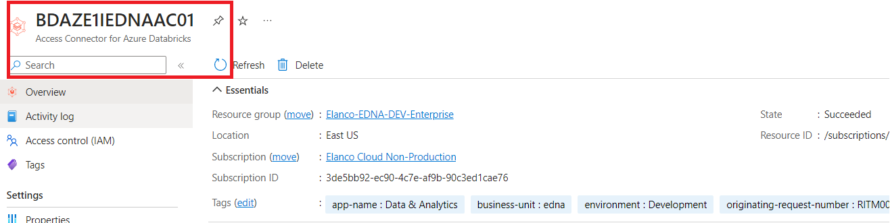
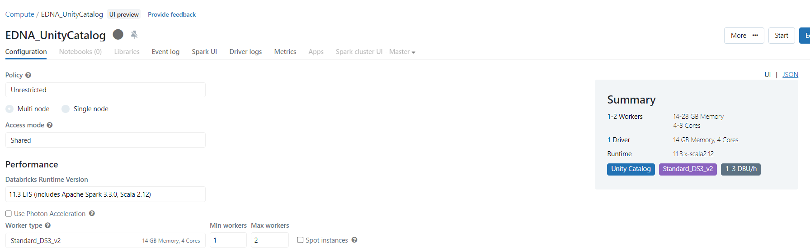
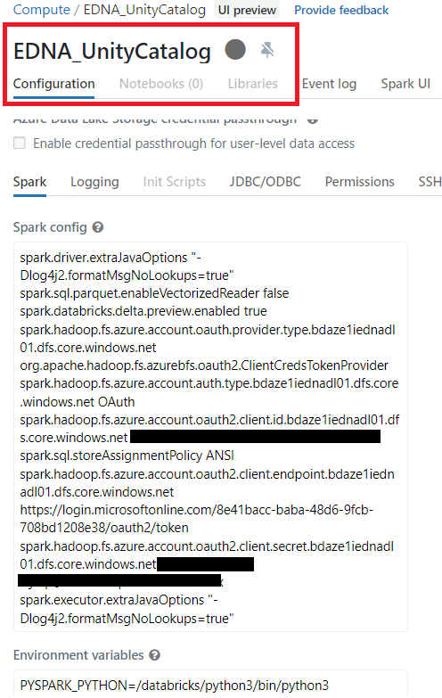
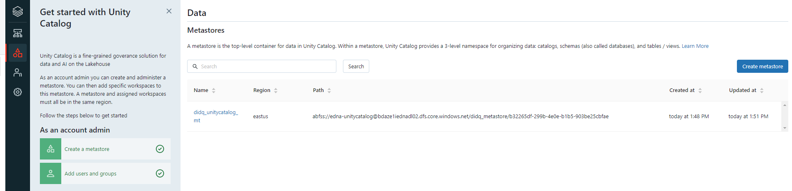
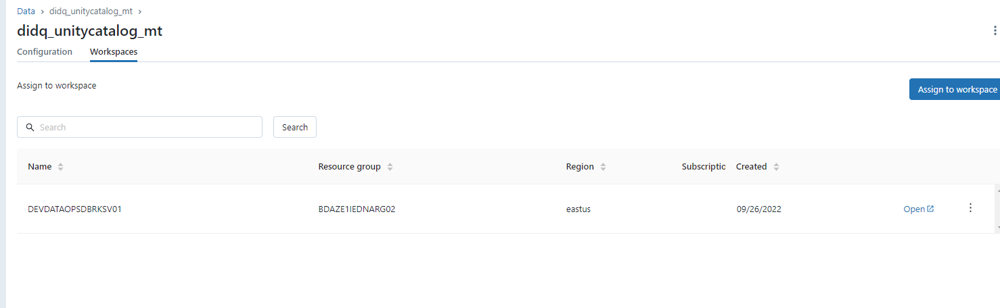

# Get Started

If you are looking to configure Unity Catalog in Databricks from scratch, here is what you need to follow:

**Step 1:** Enable SCIM which will help in enabling automated user provisioning using azure(AZ) groups. Detailed steps can be found [here](https://docs.databricks.com/administration-guide/users-groups/scim/aad.html).

**Step 2:** Create a ***Managed Identity Access Connector*** for Unity Catalog , which will connect Databricks space and Azure Storage. The access connector will show up as a separate resource in the Azure Portal.

For creating new access connector, you can refer [here](https://learn.microsoft.com/en-us/azure/databricks/data-governance/unity-catalog/azure-managed-identities#step-1-create-an-access-connector-for-azure-databricks).

**Step 3** Create a Shared Cluster for Metastore (Only Python & SQL is supported). It required additional cluster configration.(Secret,Client_Id, TenantId needs to passed in Spark configuration).

**Step 4** Setup Metastore and assign metastore to your workspace. Detailed steps can be found [here](https://learn.microsoft.com/en-us/azure/databricks/data-governance/unity-catalog/create-metastore#create-a-metastore-that-is-accessed-using-a-managed-identity-recommended).

