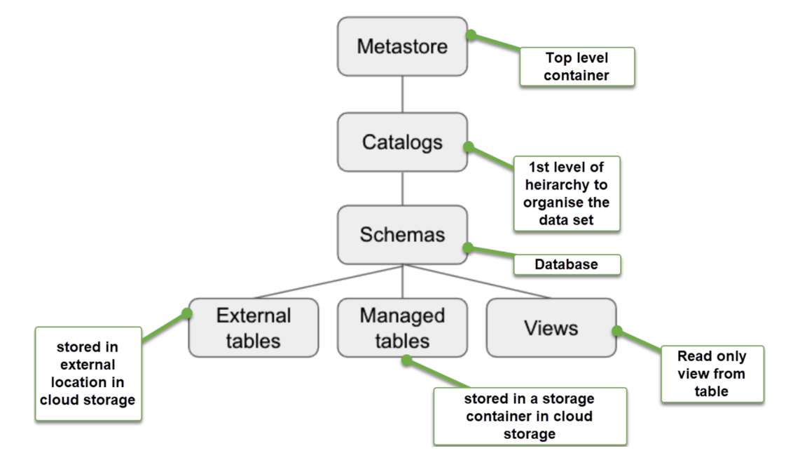

# High Level steps to Configure Unity Catalog

- [Create a storage](https://learn.microsoft.com/en-us/azure/storage/blobs/storage-quickstart-blobs-portal#create-a-container) container in your ADLS account.
- [Create an access connector](https://learn.microsoft.com/en-us/azure/databricks/data-governance/unity-catalog/azure-managed-identities#step-1-create-an-access-connector-for-azure-databricks) for Azure Databricks.
- [Assign the Storage Blob Data](https://learn.microsoft.com/en-us/azure/storage/blobs/assign-azure-role-data-access?tabs=portal) contributor role on the storage account to the managed identity for the access connector for Azure Databricks.
- [Assign yourself account administrator](https://learn.microsoft.com/en-us/azure/databricks/administration-guide/account-settings/account#assign-account-admins) in the Databricks account console.
- [Create a Unity Catalog](https://learn.microsoft.com/en-us/azure/databricks/data-governance/unity-catalog/create-metastore#create-a-metastore-that-is-accessed-using-a-managed-identity-recommended) metastore.
- [Assign a workspace to the Unity Catalog](https://learn.microsoft.com/en-us/azure/databricks/data-governance/unity-catalog/enable-workspaces#enable-your-workspace-for-unity-catalog) metastore.

If you are not a Databricks account administrator, you won’t see the option to create a metastore in the account console. If you aren’t an AAD Global Admin, you need an AAD Global Admin to log into the Databricks account console and assign your user to the account admin role.
Once you have been assigned the account admin role in Databricks, you will see the button to create a metastore in the account console.

## One or multiple metastores?

The Azure documentation recommends only creating one metastore per region and assigning that metastore to multiple workspaces. The current recommended best practice is to have one catalog that spans environments, business units, and teams. Currently, there is no technical limitation keeping you from creating multiple metastores. The recommendation is pointing you toward a single, centralized place to manage data and permissions.

Unity catalog uses a hierarchical structure. This is explained in the diagram:

