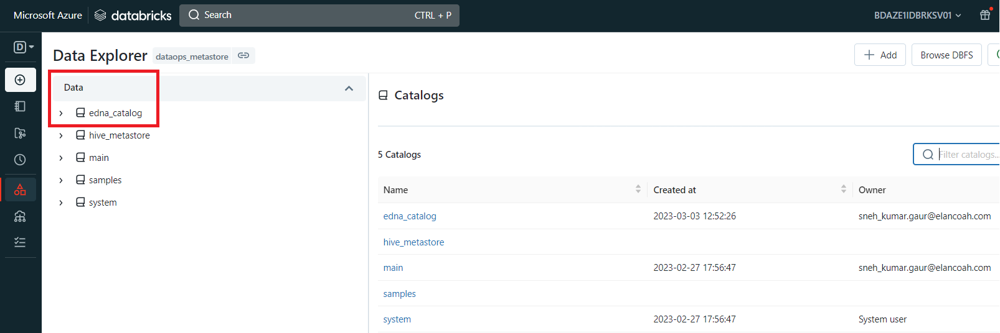

# Create Catalog

A catalog contains schemas (databases), and a schema contains tables and views.

## Pre-requisites

- One must be a Databricks metastore admin or have been granted the CREATE CATALOG privilege on the metastore.
- Databricks account must be on the Premium plan and above.
- Unity Catalog metastore should be linked to the workspace where you perform the catalog creation.

## Steps to create catalog

- Log in to a workspace that is linked to the metastore.
- Click Data Icon Data.
- Click the Create Catalog button.
- Specify the location where data for managed tables in the catalog will be stored.(Optional)
- Assign permissions for your catalog.
- Click Save.

***For more information, refer this Databricks notebook:*** [Creating catalog and managing access](https://adb-8516392274079895.15.azuredatabricks.net/?o=8516392274079895#notebook/512324329229990/command/512324329229991)

This is how it looks in the Data Explorer, once catalog is created and you have access to it:

