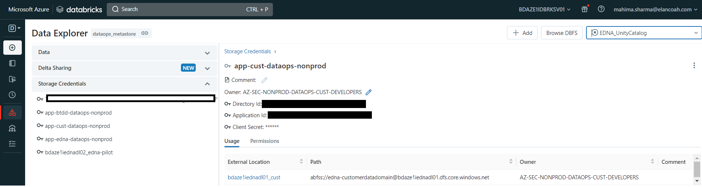
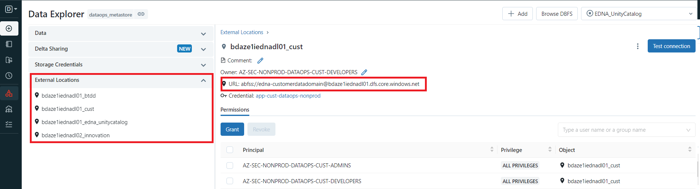
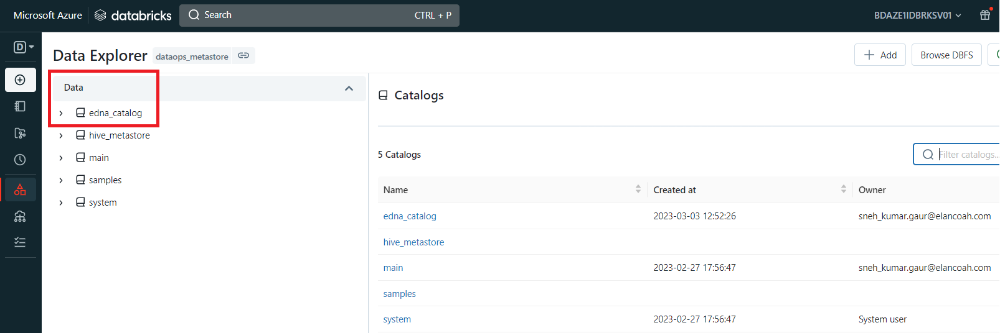
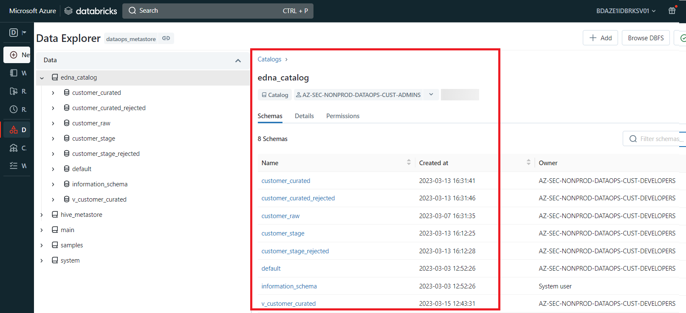
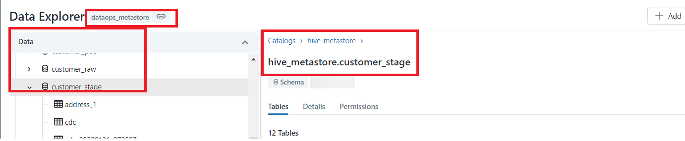
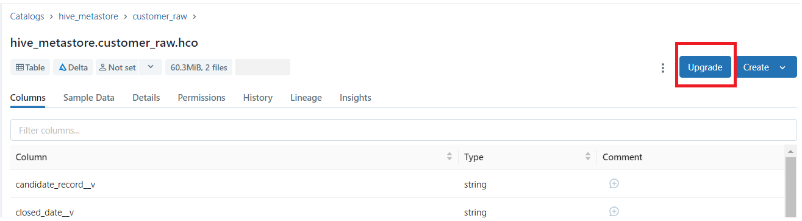
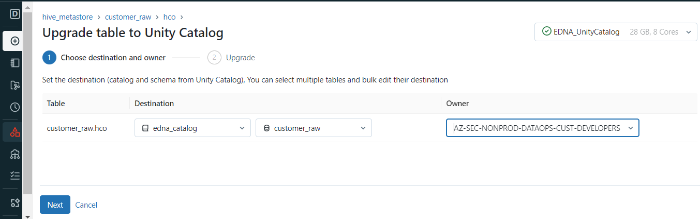
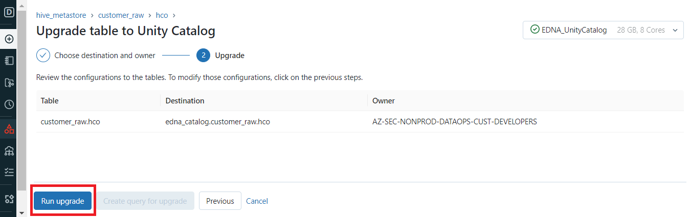
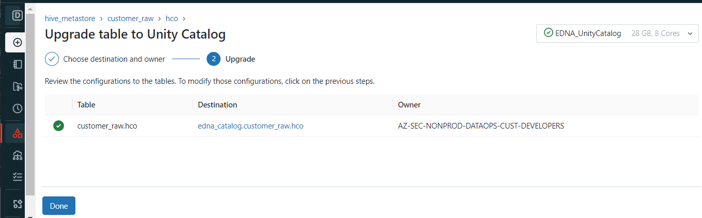
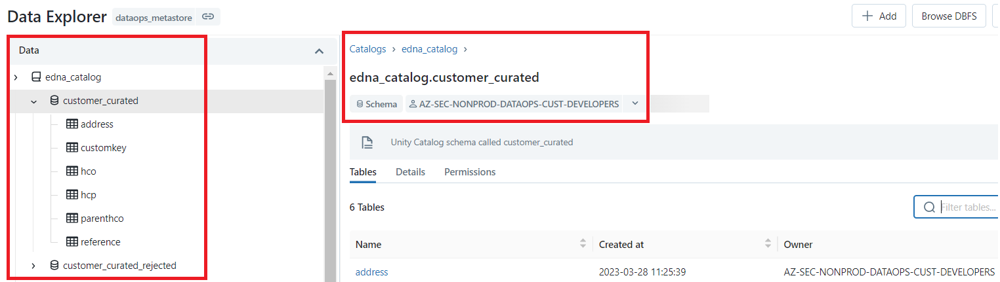

# Steps to Upgrade Delta tables to Unity Catalog

This article describes how to upgrade tables and views registered in your existing Hive metastore to Unity Catalog.
You can copy complete schemas (databases) and multiple external tables from your default Hive metastore to the Unity Catalog metastore using the Data Explorer upgrade wizard.

## Pre-requisites

- Unity Catalog should be enabled.
- A storage credential that contains the information about a service principal authorized to access the table’s location path.

- An external location that references the storage credential you just created and the path to the data on your cloud tenant.

- Catalog should be created. Steps to create catalog can be found [here](https://developer.elanco.com/dataops/5-unitycatalog/createcatalog).

## Steps

- Click Data Icon Data in the sidebar to open the Data Explorer.
- Create respective schemas in new catalog ( e.g., customer_raw, customer_stage)and grant required privileges to AZ group.

- Select hive_metastore table that you want to upgrade.

- It will give an ***Upgrade*** option on the top right corner. Click on upgrade.

- Once you click on Upgrade, it will ask to select the catalog, schema and the owner of the table.

- Click on Next after selecting, it will navigate to the Upgrade step. Click on ***Run upgrade*** button.

- Finally upgrade is completed!

- After upgrading the tables, it can viewed under ***edna_catalog*** schemas.

